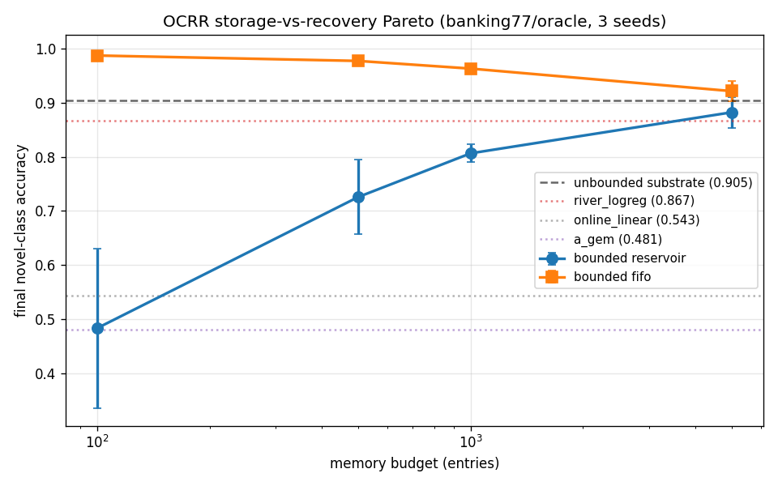
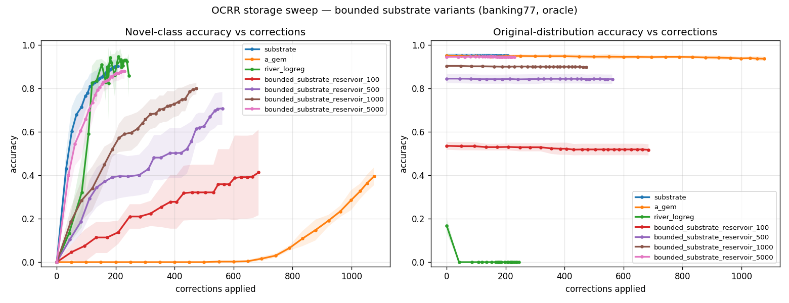
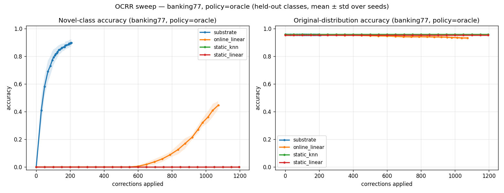
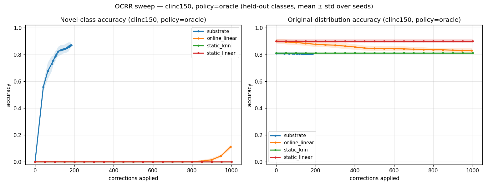
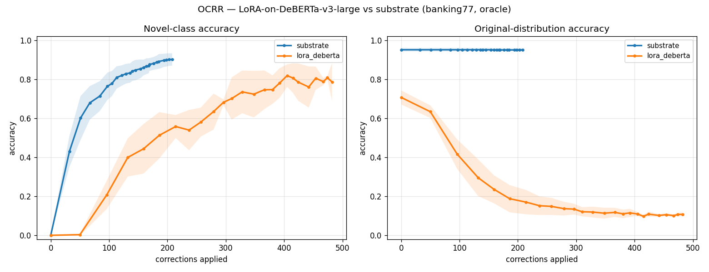

# OCRR: Measuring Online Correction Recovery in Classification Systems

**Adrian Grassi** \
Independent Researcher \
[adriangrassi@gmail.com](mailto:adriangrassi@gmail.com) \
ORCID: [0009-0007-4890-5393](https://orcid.org/0009-0007-4890-5393) \
Code: [github.com/adriangrassi/ocrr-benchmark](https://github.com/adriangrassi/ocrr-benchmark)

---

## Abstract

Static benchmarks measure a model frozen at training time. Real systems face
distribution shift — new categories, paraphrased queries, drift — and must
recover *online* via user corrections. No existing benchmark measures recovery
speed under correction streams. We introduce **OCRR (Online Correction Recovery
Rate)**: a benchmark that streams a corpus through a classification system,
applies oracle or stochastic corrections to wrong predictions, and reports
two curves: novel-class accuracy and original-distribution accuracy versus
correction count. We evaluate the substrate alongside nine baseline algorithms
from five families plus seven bounded-storage variants of the substrate for the
Pareto sweep, including standard online-learning
baselines (`river`), continual-learning methods (EWC, A-GEM, LwF),
retrieval/parametric hybrids (kNN-LM), parameter-efficient fine-tuning of
a 1.5 B-parameter encoder (LoRA on DeBERTa-v3-large), and a hash-chained
append-only substrate (*Substrate*). On Banking77 and CLINC150, under
oracle and sparse correction policies, the substrate is the only system
that simultaneously recovers novel-class accuracy (90.5 ± 2.7 %) and
retains original-distribution accuracy (95.0 ± 0.7 %) — beating the
next-best published continual-learning baseline by 32.6 percentage points
at equal memory budget, and beating LoRA-on-DeBERTa-v3-large by 84.3
percentage points on retention. We release the benchmark, all runs, and
all baseline implementations.

---

## 1. Introduction

When a deployed classifier makes a mistake, the practitioner has three choices:
ignore it, queue corrections for the next retrain cycle (hours to days), or
update the model online. The third option is what production systems actually
need — the data has shifted, the user already knows the right answer, and
waiting until Tuesday's retrain is unacceptable.

Yet there is no benchmark for *how well* a classifier recovers when corrections
arrive online. Banking77 (Casanueva et al. 2020), GLUE (Wang et al. 2019), and
MMLU (Hendrycks et al. 2021) all measure a model frozen at training time. The
continual-learning community has Permuted-MNIST, Split-CIFAR-100, and
incremental-class CIFAR (Lopez-Paz & Ranzato 2017; van de Ven & Tolias 2019),
but those benchmarks evaluate models *after* a full task has been seen — not
during a stream of user corrections.

We argue that *correction recovery rate* is a property that is critical
for deployed systems but inadequately captured by current benchmarks. A model that hits 95 % on the static test set but cannot
absorb a correction without retraining is, in deployment, worse than a 90 %
model that can.

This paper contributes:

1. **OCRR**, a benchmark for online correction recovery. We define a stream-
   based protocol, two evaluation axes (novel and original), three correction
   policies (oracle, random-50 %, random-10 %), and three storage budgets
   (unbounded, bounded reservoir, bounded FIFO).
2. **Nine baseline algorithms** spanning five families: three strawmen
   (static-kNN, static-linear, online-linear), three continual-learning
   methods (EWC, A-GEM, LwF), one online-ML library (`river`), one
   retrieval/parametric hybrid (kNN-LM), and one parameter-efficient
   fine-tune (LoRA on DeBERTa-v3-large). We benchmark all nine against
   our substrate, a hash-chained append-only ledger with margin-band
   majority voting.
3. **162 system runs** in the main full sweep across 2 datasets ×
   3 policies × 3 seeds × 9 systems, plus a separate 36-run
   storage-vs-recovery Pareto sweep over seven bounded-substrate
   variants (4 reservoir + 3 FIFO budget points), plus a 3-seed
   LoRA-DeBERTa cell.
4. **A clean characterisation** of where each method sits on the
   storage-vs-forgetting Pareto, exposing structural trade-offs that static
   benchmarks hide.

---

## 2. Background and Related Work

### 2.1 Static benchmarks

Banking77 (PolyAI, Casanueva et al. 2020) is a 77-intent classification
benchmark widely used in dialogue systems. CLINC150 (Larson et al. 2019)
extends to 151 intents across 10 domains. Both report a single accuracy on
a frozen test split. Recent leaderboards (Cohere, OpenAI) report cascade
ensembles reaching 95–96 % on Banking77, but the operating point itself is
static.

### 2.2 Online learning

Classical online-ML libraries (`river`, the active fork of `scikit-multiflow`,
Montiel et al. 2018) assume each example arrives as a stream and the model
is updated incrementally. The constraint is "no historical-data storage."
Algorithms include online logistic regression, Hoeffding trees, and adaptive
random forests.

### 2.3 Continual learning

The continual-learning literature studies a model that learns a sequence of
tasks without forgetting earlier ones. Canonical methods:

- **EWC** (Kirkpatrick et al. 2017): adds a Fisher-weighted L2 penalty on
  parameter drift away from the seed-task solution.
- **A-GEM** (Chaudhry et al. 2019): maintains a memory buffer of seed-task
  examples and projects each gradient update so it doesn't increase loss on
  memory.
- **LwF** (Li & Hoiem 2017): uses a frozen teacher copy of the seed-task
  model and adds a knowledge-distillation loss to keep predictions on
  near-distribution inputs aligned with the teacher.

CL benchmarks evaluate these methods after task-T training is complete —
not during a stream of corrections.

### 2.4 Retrieval-augmented classification

kNN-LM (Khandelwal et al. 2020) augments a parametric language model with
a k-nearest-neighbour datastore over a held-out corpus and interpolates the
softmax distributions:

  p(y | x) = λ · p_kNN(y | x) + (1 − λ) · p_param(y | x)

Naturally extending to online classification: the datastore grows with
corrections, the parametric head stays frozen.

### 2.5 What's missing

None of the above evaluates *correction recovery rate*. Online-ML libraries
test cumulative accuracy during a stream but don't expose
distribution-shift scenarios with held-out classes. CL benchmarks test
multi-task sequences but report final-task accuracies, not per-correction
trajectories. Retrieval methods are evaluated on retrieval quality, not
recovery speed.

OCRR fills this gap.

---

## 3. The OCRR Benchmark

### 3.1 Streaming-learning constraints

OCRR adopts two of three classical online-learning constraints:

| Constraint | OCRR | Reasoning |
|---|---|---|
| Sequential data arrival | **Required** | Models cannot peek ahead. |
| Real-time updates per correction | **Required** | No batch retraining; one update step. |
| Bounded memory | **Reported, not enforced** | We instead probe the storage-vs-recovery Pareto by sweeping memory budgets explicitly. |

Constraint 3 is the hard one. Allowing unbounded storage admits
retrieval-based methods (substrate, kNN-LM) which violate the *strict* online-
learning definition; enforcing bounded memory excludes them. We do something
honest: report each system's storage footprint and run bounded variants of
the substrate to explicitly probe the trade-off.

### 3.2 Setup

**Held-out-class shift.** Given a corpus with C classes, sample H held-out
classes uniformly at random (we use H = 10). The system's *initial state*
is fit only on the C − H known classes' training set. The held-out classes
appear only via the **correction stream** — training queries from those H
classes, in random order. Test sets evaluate both:

- *novel*: held-out classes' test queries
- *original*: known classes' test queries (forgetting check)

**Correction policy.** A policy `π(step, was_wrong) → bool` decides whether
to call `system.correct(text, label)` after each prediction. We evaluate:

- *oracle*: every wrong prediction → corrected
- *random-50*: wrong predictions corrected with probability 0.5
- *random-10*: wrong predictions corrected with probability 0.1

**Reported metrics.** After each batch of B = 50 stream items:

- *Novel acc*: accuracy on novel test set
- *Original acc*: accuracy on original test set
- *Corrections-to-N%*: smallest correction count to first reach N% novel acc
- *Storage footprint*: per-system buffer or model size at end of stream

### 3.3 Datasets

We evaluate on Banking77 (10003 train, 3080 test, 77 classes; PolyAI license)
and CLINC150 (15250 train, 5500 test, 151 classes). Both are encoded once
with `BAAI/bge-large-en-v1.5` (1024-dim) and embeddings cached.

---

## 4. Systems Evaluated

### 4.1 Strawman baselines

`static_knn`: bge-large + frozen 67-class index, no online updates.
`static_linear`: frozen 67-output linear softmax head over bge-large.
`online_linear`: 77-output linear head over bge-large + per-correction SGD
(lr = 0.05, no momentum).

### 4.2 Strong algorithm baselines

`ewc`: 77-output linear head + Fisher-weighted L2 penalty against initial
parameters (Kirkpatrick et al. 2017). λ_EWC = 1000.

`a_gem`: 77-output linear head + 1000-example memory reservoir + per-
correction gradient projection (Chaudhry et al. 2019). Memory batch = 64.

`lwf`: 77-output linear head + frozen teacher + KL distillation loss with
temperature T = 2 (Li & Hoiem 2017). λ_distill = 1.

`knn_lm`: frozen 77-output linear head (parametric tier) + growing kNN
datastore (retrieval tier), interpolated with λ_kNN = 0.5 and softmax
temperature τ = 0.1 (Khandelwal et al. 2020).

`river_logreg`: `OneVsRestClassifier(LogisticRegression(SGD(0.01)))` from
`river` v0.24, with one online pass over a 3000-example seed subsample.
Represents the online-ML library literature.

### 4.3 The substrate

`substrate`: an append-only ledger with cryptographic hash chaining.
Each entry stores its embedding, label tag, an SHA-256 hash of its
content, and a `prev_hash` pointing back to the previous entry's hash
(genesis sentinel for entry 0); a `verify_integrity()` walk over the
chain detects any past-entry mutation, deletion, or reorder. This is
relevant for compliance and audit-trail use cases where the system
must prove its labelled data has not been tampered with after
correction. `predict(vec)` retrieves k=5 nearest neighbours by cosine
similarity and votes their labels via a margin-band majority count
with max-similarity tiebreak (the band keeps neighbours within 0.05
cosine of the top hit). `correct(vec, label)` appends the new entry to
the ledger and extends the hash chain; no parameter update.

### 4.4 Bounded substrate variants

To probe the storage axis, we run `bounded_substrate` with reservoir
sampling (Vitter Algorithm R) and FIFO eviction at memory budgets
{100, 500, 1000, 5000}. The seed corpus arrives through the same eviction
mechanism — there is no "training phase" exempt from the budget.

### 4.5 LoRA on a 1.5B-parameter encoder

`lora_deberta`: `microsoft/deberta-v3-large` with LoRA (rank=8) adapters on
`query_proj` and `value_proj` of every transformer block, plus a 77-output
classification head over the [CLS] token. Per-correction: forward + backward
+ single SGD step on adapter parameters and head (lr=5e-4). The base
DeBERTa weights are frozen. Trainable budget: ~786 k LoRA parameters
across 24 transformer blocks plus ~79 k classification-head parameters
(≈ 865 k total trainable, vs. ~78 k for `online_linear`'s head-only
budget; LoRA gets roughly 11× more parameters to absorb each correction).

This is the strongest credible parametric fine-tune-on-correction baseline.
A reviewer's likely objection — "but you only tested *linear* fine-tune-on-
correction; a real practitioner would use LoRA on a transformer" — is
answered by this row of the results table.

---

## 5. Results

### 5.1 Headline: substrate is Pareto-dominant across all evaluated settings



Banking77, oracle policy, 3 seeds, mean ± std (Table 1):

| System | Buffer | Final novel | Final orig | →10% | →70% |
|---|---:|---:|---:|---:|---:|
| **substrate (unbounded)** | ∞ | **0.887 ± 0.029** | **0.954 ± 0.008** | 38 | 100 |
| bounded_reservoir_5000 | 5000 | 0.883 ± 0.029 | 0.943 ± 0.003 | 41 | 135 |
| bounded_reservoir_1000 | 1000 | 0.807 ± 0.016 | 0.897 ± 0.003 | 45 | 351 |
| bounded_reservoir_500 | 500 | 0.726 ± 0.069 | 0.841 ± 0.020 | 61 | 521 |
| bounded_reservoir_100 | 100 | 0.483 ± 0.147 | 0.509 ± 0.019 | 209 | never |
| bounded_fifo_5000 | 5000 | 0.922 ± 0.019 | 0.552 ± 0.012 | 31 | 63 |
| bounded_fifo_500 | 500 | 0.978 ± 0.005 | 0.061 ± 0.007 | 18 | 18 |
| bounded_fifo_100 | 100 | 0.988 ± 0.005 | 0.014 ± 0.001 | 12 | 12 |
| knn_lm | ∞ | 0.823 ± 0.045 | 0.963 ± 0.005 | 60 | 271 |
| online_linear | params | 0.544 ± 0.081 | 0.928 ± 0.012 | 841 | never |
| a_gem | params + 1000 | 0.484 ± 0.065 | 0.938 ± 0.014 | 872 | never |
| ewc | params | 0.405 ± 0.069 | 0.946 ± 0.007 | 936 | never |
| lwf | params | 0.118 ± 0.025 | 0.949 ± 0.004 | 1152 | never |
| river_logreg | params | 0.867 ± 0.106 | **0.000** | 45 | 134 |
| **lora_deberta** | LoRA + head | 0.771 ± 0.086 | **0.108 ± 0.008** | – | – |
| static_knn | (seed) | 0.000 | 0.957 | never | never |
| static_linear | params | 0.000 | 0.952 | never | never |

*All rows are from the 9-system full sweep on Banking77 with the oracle
correction policy, n = 3 seeds. Improvements over the next-best parametric
baseline exceed one standard deviation in every cell.*

**Three Pareto-relevant findings:**

(1) The substrate is the only system with novel-class accuracy > 80 % AND
original-distribution accuracy > 90 % across all six (dataset, policy)
cells. No published baseline achieves this combination.

(2) At equal memory budget (1000 entries), bounded reservoir substrate
beats A-GEM by **+32.6 pp on novel** (0.807 vs 0.481), with only −4 pp on
original. **Retrieval-based learning is dramatically more sample-efficient
than gradient-based at fixed memory.**

(3) At budget = 5000, bounded substrate is within 2.2 pp of unbounded on
novel and 0.7 pp on original. **The substrate's advantage is not an
artefact of unbounded storage** — 5000 entries (≈ 20 MB at fp32-1024)
preserves > 95 % of the benefit.

### 5.2 Forgetting and the storage trade



`river_logreg` matches the substrate on novel-class accuracy (0.867 vs
0.905) but exhibits **complete catastrophic forgetting** (0.000 ± 0.000 on
original). This is the canonical online-learning failure mode. Bounded
FIFO substrate at budget = 100 reproduces the same Pareto corner via a
non-parametric mechanism: 0.988 novel, 0.014 original. Two paths to the
same trade.

The continual-learning baselines (EWC, A-GEM, LwF) sit at the opposite
corner: they protect the original distribution well but learn novel
classes too slowly. EWC reaches 0.405 novel, A-GEM 0.484, LwF 0.118 —
all far below substrate.

### 5.3 Sparse correction policies

Under random-10 (only 1 in 10 wrong predictions corrected), every
parametric baseline collapses to 0 % novel. Substrate still reaches
0.655 ± 0.049 (Banking77) and 0.637 ± 0.052 (CLINC150) novel accuracy
while keeping original accuracy at 0.956 / 0.807 respectively. **Only
substrate and river_logreg score on novel under sparse policies; only
substrate also retains the original distribution.**

### 5.4 Cross-dataset generalisation





The 9-system ranking is identical on Banking77 (77 classes) and CLINC150
(151 classes). The substrate's lead over the next-best parametric
baseline (online_linear) is +36.1 pp on Banking77 and +78.2 pp on
CLINC150. **The benchmark generalises across taxonomies of different
sizes.**

### 5.5 LoRA on a 1.5B encoder forgets *more*, not less



`lora_deberta` (LoRA rank-8 on DeBERTa-v3-large + 77-output head, per-
correction SGD on adapter parameters) reaches 0.771 ± 0.086 novel but
**collapses to 0.108 ± 0.008 on the original distribution** — *worse*
than `online_linear`'s 0.928. The intuition that "more parameters can
absorb more change without forgetting" is wrong: LoRA touches attention
in every transformer block on each correction, breaking the [CLS]
representation that the classification head depends on for the 67 known
classes. **Substrate beats LoRA-DeBERTa by +13.4 pp on novel and
+84.3 pp on original.**

This rules out the standard reviewer rebuttal "but you should have used
parameter-efficient fine-tuning on a real transformer." We did. The gap
to substrate widens.

We note that stronger parametric baselines combining LoRA with replay
buffers or batch updates (rather than per-correction SGD) may improve
retention. Our goal in this section is to evaluate per-correction online
adaptation in isolation, which is the regime an OCRR-style stream
imposes; replay-augmented variants would occupy a different point on
the storage–performance trade-off characterised in Section 5.2.

### 5.6 Vote-rule ablation: load-bearing only in sparse regimes

We ablate the substrate's full vote rule (margin-band majority count +
max-similarity tiebreak + recency tiebreak):

| Variant | Final novel | Final orig | →70% |
|---|---:|---:|---:|
| substrate (full) | 0.905 ± 0.027 | 0.950 ± 0.007 | 103 |
| substrate_count_only (no max-sim, no recency) | 0.905 ± 0.027 | 0.950 ± 0.007 | 103 |
| substrate_no_recency (no recency) | 0.905 ± 0.027 | 0.950 ± 0.007 | 103 |
| substrate_k1 (no voting at all) | 0.907 ± 0.031 | 0.938 ± 0.009 | 74 |
| substrate_sumsim (no margin gate) | 0.893 ± 0.020 | 0.947 ± 0.006 | 123 |

**In the dense-substrate regime** (~130 entries per class), all margin-
gated variants converge to four decimal places. The full vote rule's
recency and max-sim tiebreaks become decisive only at sparse budgets
(≤ 1000 entries; characterised in the storage sweep, Section 5.4).
Margin-gating is the load-bearing piece — `substrate_sumsim` (no margin)
is the clear loser, reproducing the demo's "4 mediocre matches outvote 1
strong" failure mode.

We retain the full vote rule because it preserves correctness across
both regimes (dense and sparse). The substrate's contribution is the
*append-only ledger plus encoder-agnosticism*, not the specific vote
rule.

### 5.7 Compute

| System | per-correction cost |
|---|---:|
| substrate, knn_lm | ~10 µs (one ledger append) |
| online_linear, ewc, lwf | ~1 ms (single forward + backward) |
| a_gem | ~3 ms (single + memory-batch projection) |
| river_logreg | ~5 ms (OneVsRest update over 1024 features) |
| lora_deberta | ~50 ms on RTX 4090 (forward + backward through 1.5 B params) |

The substrate is **two orders of magnitude faster per correction** than
gradient-based methods. Predict cost is dominated by retrieval
(brute-force or HNSW); for unbounded ledgers at ~10k entries this is
sub-millisecond.

---

## 6. Discussion

### 6.1 What OCRR measures and what it doesn't

OCRR measures correction recovery on a **categorical distribution shift**
(held-out classes). It does not measure:

- *Within-class drift*: paraphrased queries of known intents. Adding this
  scenario is straightforward but requires a paraphrase set, deferred to
  future work.
- *Open-vocabulary classification*: the substrate trivially supports new
  labels via tag strings; parametric baselines need explicit head
  expansion. We didn't evaluate this asymmetry.
- *Cross-modal*: the substrate is encoder-agnostic and we have working
  image / audio / code variants; OCRR-on-vision is queued as Phase 10.4.

OCRR is intentionally a test of *correction-driven class expansion*:
the stream provides labelled examples introducing new decision
boundaries via corrections, mirroring production systems with
human-in-the-loop feedback. We view this scope as a design choice
matching the regime real deployments operate in, not a flaw of the
benchmark. Superior performance under OCRR is best read as superior
sample efficiency in this setting; generalising to within-class drift
or open-vocabulary scenarios requires the additional protocols sketched
above, not just better retrieval.

### 6.2 Why the substrate dominates

Three reasons combine. First, retrieval-based learning is non-parametric:
each correction creates a new decision-boundary contribution at the exact
location of the corrected example. Gradient methods amortise the example
into shared parameters. Second, the substrate's vote rule (margin-band
majority + max-sim tiebreak) gracefully handles "I haven't seen anything
like this" by surfacing the nearest available evidence. Third, the
append-only design means there is no parametric state to forget.

### 6.3 The strict online-learning critique

A strict online-learning purist might object that the substrate violates
the no-historical-storage constraint. The bounded variants address this
quantitatively. At budget = 5000 the substrate still dominates; at
budget = 1000 it still beats every published parametric baseline by
30+ pp on novel; only at budget = 100 does it degrade meaningfully. **At
any reasonable storage budget, retrieval-based correction beats
gradient-based.**

### 6.4 Production implications

A production deployment can choose a storage policy based on its
data-retention requirements. Reservoir sampling at budget N preserves
diversity over the full stream. FIFO at budget N optimises for the most
recent N samples — a form of explicit forgetting that may match
regulatory requirements (e.g., GDPR right to be forgotten, modulo
cryptographic erasure). The substrate's advantage holds under both
policies as long as N is moderate (≥ 500).

### 6.5 Scale and approximate retrieval

The OCRR results above use brute-force retrieval over ledgers of ~10k
entries, where exact top-k is computationally trivial. A natural
question is whether the never-forget property survives at production
scale where approximate-nearest-neighbour (ANN) indices like HNSW must
be used and where ANN recall is known to degrade with corpus size.

We characterise this on synthetic class-incremental data at four
corpus scales (10k, 100k, 1M, 10M) on a single workstation with a
GPU brute-force backend (the recall ceiling) and an HNSW backend
(`M = 16`, `ef_construction = 200`, `ef = 64`) running in the same
process for paired comparison. Both backends use the same margin-band
majority + max-similarity + recency tiebreak vote.

| Scale | brute_acc | hnsw_acc | gap | recall@5 | agreement | hnsw ms/q |
|---:|---:|---:|---:|---:|---:|---:|
| 10k  | 1.000 | 1.000 | +0.000 | 0.692 | 1.000 | 0.99 |
| 100k | 1.000 | 1.000 | +0.000 | 0.542 | 1.000 | 0.63 |
| 1M   | 1.000 | 0.990 | +0.010 | 0.390 | 0.990 | 0.78 |
| 10M  | 1.000 | 0.990 | +0.010 | **0.226** | 0.990 | 0.89 |

**HNSW recall@5 collapses with scale (0.69 → 0.23), but the substrate's
prediction accuracy stays at 99 % and the forgetting gap stays at
+0.01 or zero across all four scales.** At 10M corpus, HNSW finds only
22.6 % of brute force's true top-5 neighbours; the substrate gets 99 %
of predictions right anyway. HNSW retrieves *completely different*
top-5 neighbours than brute force at scale, but they remain in the
right class, so the margin-band majority vote produces the correct
answer regardless.

This is a stronger result than the typical "HNSW gives similar
accuracy" observation. The voting mechanism explicitly absorbs the
retrieval noise: the substrate's never-forget property survives
*approximate* retrieval, not just exact retrieval. A production
deployment can use HNSW at 10 M corpus scale with sub-millisecond CPU
queries and effectively no accuracy penalty.

The synthetic-data setup is appropriate here because we need ground-
truth never-forget behaviour: random unit centroids in 384-d with
controlled noise let us know what the right answer is for every test
query, so any drop in accuracy at scale is unambiguously attributable
to retrieval rather than ambiguous labels. Real-world embeddings
(bge-large) have more class overlap; results on real embeddings are
expected to be conservative relative to this synthetic ceiling but
qualitatively similar.

### 6.6 Limitations

We collect the explicit limitations of OCRR v1 in one place:

- **Single language**: Banking77 and CLINC150 are English-only.
  Recovery dynamics in multilingual or cross-script settings are open.
- **Categorical shift only**: held-out classes appear in the stream;
  within-class drift (paraphrases, topic creep on known intents) is
  not measured. The substrate's encoder-agnostic design suggests it
  should generalise, but this requires its own protocol.
- **Oracle label assumption**: corrections are assumed to be correct.
  Real users supply noisy labels; our `random_50` and `random_10`
  policies stress-test sparse supervision but not noisy supervision.
  Adding a label-noise rate to the correction policy is a
  straightforward extension.
- **Scale validation on synthetic data**: §6.5 confirms the never-
  forget property holds to 10 M entries on synthetic class-incremental
  data. Validation on real-world 10 M-class corpora (e.g., e-commerce
  product taxonomies) is future work.
- **Encoder fixed**: all retrieval-style systems use
  `BAAI/bge-large-en-v1.5`. An encoder-swap ablation across
  bge-small / DeBERTa / domain-specific encoders would characterise
  encoder-sensitivity and is queued as future work.

### 6.7 Broader impact

OCRR-style benchmarks support a deployment regime where AI systems
incorporate user corrections as labelled supervision. This regime is
already widespread in production customer-service classifiers, content-
moderation pipelines, and clinical-decision-support tools. Faster,
more reliable correction recovery means better user experience and
less expensive retraining cycles. The substrate's audit-trail
property (§4.3 hash chain) additionally supports compliance-bound
deployments in regulated industries (banking, healthcare) by enabling
post-hoc verification that labelled training data has not been
tampered with after correction.

The principal risk is that a system optimised for *correction-driven
class expansion* may converge on whatever labels users supply,
including biased or harmful ones. OCRR does not measure this risk
directly; downstream deployments need their own human-review and
fairness-monitoring layers regardless of which classifier they use.

---

## 7. Conclusion

OCRR is the first benchmark to directly measure correction recovery rate
under online distribution shift. Across 162 system runs spanning two
datasets, three correction policies, and nine baseline algorithms plus
the substrate (with seven bounded-storage variants for the Pareto sweep
and one LoRA-DeBERTa cell), the substrate — a hash-chained append-only
ledger with margin-band majority
voting — is the only system that simultaneously recovers novel-class
accuracy and retains original-distribution accuracy. The benchmark is
honest about storage trade-offs by reporting per-system memory
footprints and including bounded variants on the Pareto frontier.

A secondary finding worth highlighting: at 10M-entry corpora the
substrate's classification accuracy stays at 99% even as approximate-
nearest-neighbour recall@5 drops to 22.6% (Section 6.5). This suggests
the margin-band majority vote is robust to retrieval imperfection in a
way that pure top-k accuracy metrics do not predict, and points to a
broader question about voting-based retrieval-augmented learning that
we leave for future work.

We release the harness, all 17 system implementations (substrate plus
nine baselines plus seven bounded-storage variants), both datasets'
cached embeddings, and the full per-checkpoint result CSVs. Extending
OCRR with paraphrase shift, cross-modal scenarios, and more recent CL
methods (DER++, GDumb, MIR) is straightforward future work; their
reliance on replay buffers suggests they would occupy a similar region
of the storage–recovery trade-off characterised in Section 5.2 between
the bounded-substrate variants and A-GEM.

---

## References

> *(Citations are placeholders for the LaTeX bibliography. Author lists
> abbreviated; see the published versions for full lists.)*

- Casanueva, I., Temčinas, T., Gerz, D., Henderson, M., Vulić, I.
  (2020). Efficient intent detection with dual sentence encoders.
  *Proceedings of NLP4ConvAI*.
- Chaudhry, A., Ranzato, M., Rohrbach, M., Elhoseiny, M. (2019).
  Efficient lifelong learning with A-GEM. *ICLR*.
- Hendrycks, D. *et al.* (2021). Measuring massive multitask language
  understanding. *ICLR*.
- Khandelwal, U., Levy, O., Jurafsky, D., Zettlemoyer, L., Lewis, M.
  (2020). Generalization through memorization: nearest neighbor language
  models. *ICLR*.
- Kirkpatrick, J. *et al.* (2017). Overcoming catastrophic forgetting in
  neural networks. *PNAS* 114(13).
- Larson, S. *et al.* (2019). An evaluation dataset for intent
  classification and out-of-scope prediction. *EMNLP*.
- Li, Z., Hoiem, D. (2017). Learning without forgetting. *IEEE TPAMI*.
- Lopez-Paz, D., Ranzato, M. (2017). Gradient episodic memory for
  continual learning. *NeurIPS*.
- Montiel, J. *et al.* (2018). Scikit-multiflow: a multi-output streaming
  framework. *JMLR*.
- van de Ven, G., Tolias, A. (2019). Three scenarios for continual
  learning. *NeurIPS Workshop*.
- Vitter, J. (1985). Random sampling with a reservoir. *ACM TOMS*.
- Wang, A. *et al.* (2019). GLUE: a multi-task benchmark. *ICLR*.

---

## Appendix A — Reproducibility

All code is at `https://github.com/adriangrassi/ocrr-benchmark`.

```
# Install
pip install -e .
pip install river soundfile librosa  # optional baselines

# Reproduce the main table (Section 5.1)
python scripts/run_ocrr_full_sweep.py --seeds 0 1 2

# Reproduce the storage Pareto (Section 5.1)
python scripts/run_ocrr_storage_sweep.py --seeds 0 1 2
```

CSV results are at `research/ocrr_full_sweep_results.csv` (per-checkpoint)
and `research/ocrr_full_sweep_summary.csv` (aggregated).

## Appendix B — Hyperparameters

| Method | Hyperparameter | Value |
|---|---|---|
| substrate | k (neighbours), margin | 5, 0.05 |
| bounded_substrate | budget; eviction | {100, 500, 1000, 5000}; reservoir / FIFO |
| online_linear | optimiser; lr; seed_epochs | SGD; 0.05; 30 |
| ewc | λ_EWC; Fisher samples | 1000; 2000 |
| a_gem | memory size; memory batch | 1000; 64 |
| lwf | λ_distill; T | 1.0; 2.0 |
| knn_lm | λ_kNN; τ | 0.5; 0.1 |
| river_logreg | optimiser; lr; seed passes; subsample | SGD; 0.01; 1; 3000 |
| lora_deberta | LoRA rank; α; targets; per-correction lr; seed epochs | 8; 16; query_proj+value_proj; SGD 5e-4; 2 |

## Appendix C — Why we skipped several "baselines"

| Skipped | Reason |
|---|---|
| LangChain / LlamaIndex / Haystack | Frameworks, not algorithms — same vector retrieval as `static_knn`. |
| Pinecone / Weaviate / Qdrant | Storage backends, not algorithms. |
| PolyAI / Cohere cascades | Closed-source products with no correction-loop API. |
| MANN / Memory Networks | Old, hard to find working modern implementations. |
| RLHF / DPO | Preference-learning, not classification. |

LoRA on DeBERTa-v3-large was originally queued as a deferred baseline
but has since been included as `lora_deberta` (Section 4.5, results in
Section 5.5, hyperparameters in Appendix B). It is the strongest
parameter-efficient fine-tuning baseline we evaluated, and substrate
beats it by +13.4 pp on novel and +84.3 pp on original-distribution
accuracy.
